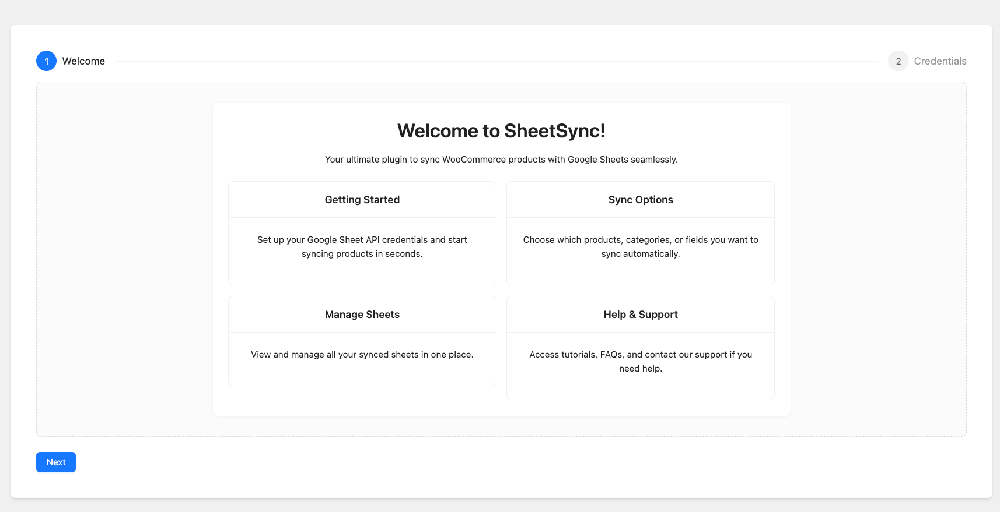
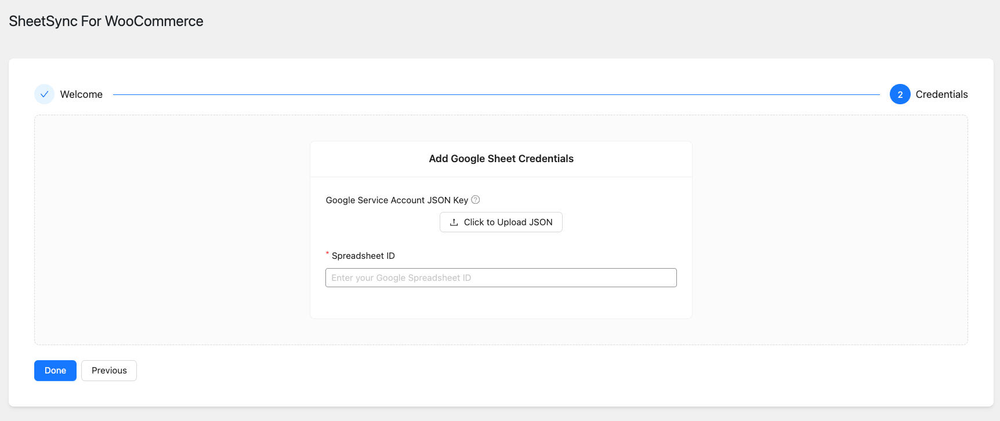
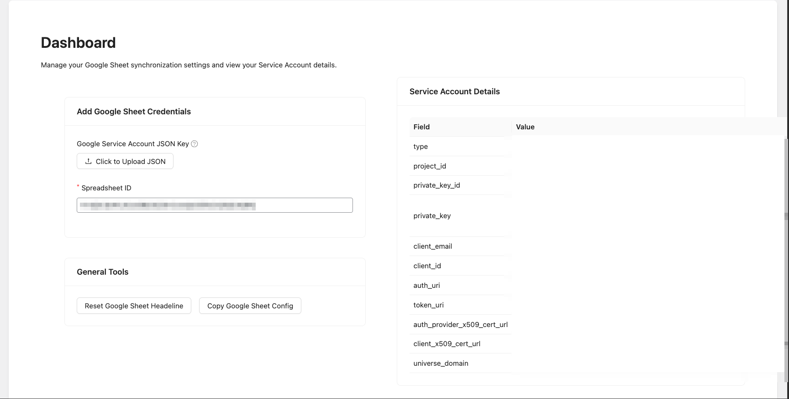

# Sheetsync: WordPress & Google Sheets Integration

Sheetsync is a WordPress plugin that seamlessly synchronizes data between your WordPress site and Google Sheets.  

No more endless clicking in the admin dashboard—update products, prices, or custom data right from a spreadsheet.  
Perfect for **WooCommerce shops** or any site that handles large-scale data management.

---

## 🚀 Features

- 🔄 **Bidirectional Sync** — Keep WordPress data and Google Sheets in sync.  
- 🔐 **Secure Authentication** — Uses a Google Service Account for direct, secure access.  
- ⚡ **REST API Integration** — Reliable communication via the WordPress REST API.  
- 🛠 **Customizable** — Extendable to support custom fields and data types.  
- 📊 **Bulk Management** — Edit hundreds of products at once from a spreadsheet.  

---

## 📦 Installation

### 1. Requirements
Before installing, ensure you have:
- ✅ A WordPress installation (latest version recommended).  
- ✅ A Google Cloud Project with **Google Sheets API** + **Google Drive API** enabled.  
- ✅ A Google Service Account with credentials (`.json` key file).  

### 2. Plugin Installation
  1. Navigate to the repository's Releases page on GitHub.
  2. Find the desired version and download the .zip file.


### 3. Activate the Plugin
1. In your WordPress Dashboard, go to **Plugins → Installed Plugins**.  
2. Activate **Sheetsync**.  

---

## ⚙️ Configuration

After activation, configure Sheetsync with your Google credentials.

### Step 1 — Access the Dashboard
- In WordPress Admin, go to **Sheetsync** from the left-hand menu.  

### Step 2 — Enter Credentials
- Navigate to the **Credentials** tab.  
- Copy the entire JSON content from your Google Service Account file.  
- Paste it into the provided text area (include the `{}` braces).  

### Step 3 — Configure Google Sheet
#### A. Share Your Sheet
- Open your target Google Sheet.  
- Click **Share**.  
- Paste your Service Account email (e.g. `sheetsync-service-account@your-project-id.iam.gserviceaccount.com`).  
- Give it **Editor** access. ✅  

#### B. Add Google Apps Script
- In WordPress → **Sheetsync Dashboard**, click **Copy Google Sheet Config**.  
- This copies a pre-configured Apps Script snippet.  
- In Google Sheets: **Extensions → Apps Script** → Paste the script.  
- Update the line:
  ```js
  var webhookUrl = 'https://your-website.com/wp-json/sheetsync/v1/sync-from-sheet';
  ```
- Save. 💾  

#### C. Set Trigger
- In Apps Script editor, click the **clock icon** (Triggers).  
- Add a new trigger:
  - Function: `onEdit`  
  - Deployment: `Head`  
  - Event source: `From spreadsheet`  
  - Event type: `On edit`  
- Save & authorize the script. 🔑  

---


## 🛠 Usage

Once configured, syncing is automatic:

- **From Sheet → WordPress:**  
  Editing a product row in Google Sheets triggers `onEdit`, which sends updates to WordPress via REST API.

- **From WordPress → Sheet:**  
  WordPress updates back into Google Sheets.  

### 📝 Sheet Structure
- **First column** → Product ID (used to match WordPress products).  
- **Other columns** → Product fields (e.g., title, price, stock, SKU, etc.).  

Example:

| ID   | Name          | Price | Stock |
|------|---------------|-------|-------|
| 123  | Blue T-Shirt  | 25    | 100   |
| 456  | Red Hoodie    | 40    | 50    |

---

## 🤝 Contributing

Contributions are welcome! 🎉  
- Fork the repo  
- Create a feature branch  
- Submit a Pull Request  

---

## 📜 License
MIT License. Free to use, modify, and distribute.  

---

## 📷 Screenshots (Recommended)



---
